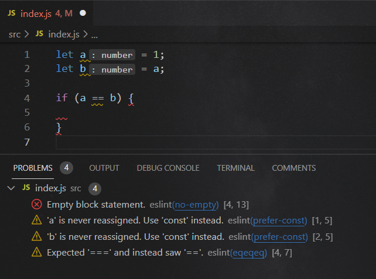
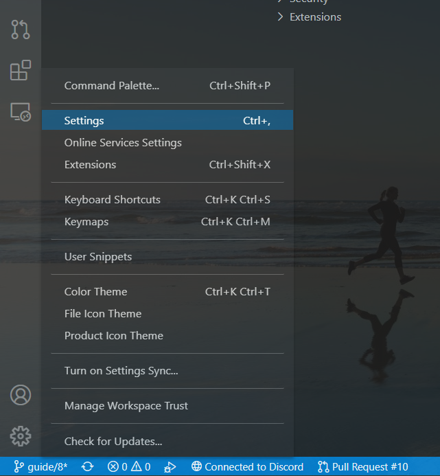
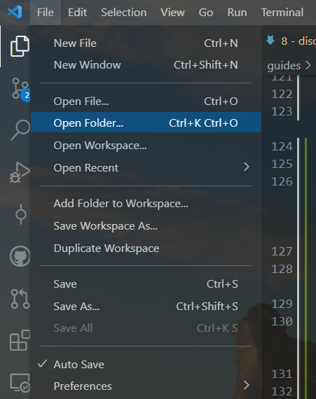
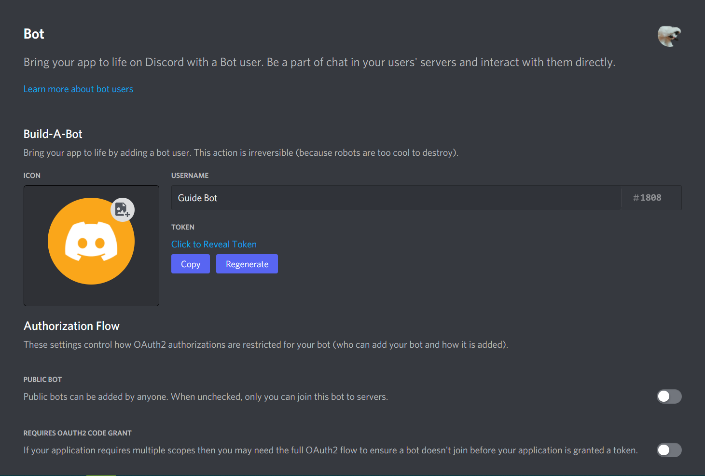
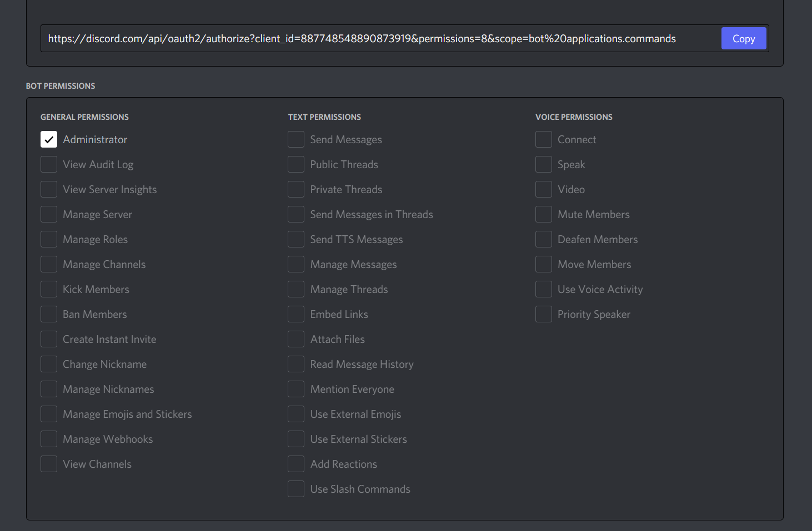

# discord.js

In questo nuovo articolo inizieremo a sviluppare il nostro bot in JavaScript.

Per farlo utilizzeremo una libreria JavaScript chiamata **discord.js** che ci permetterà di interagire con DIscord facilmente.

Prima di iniziare, però, diamo uno sguardo agli ultimi strumenti che ci aiuteranno nello sviluppo del bot.

## Sommario

- [discord.js](#discordjs)
  - [Sommario](#sommario)
  - [ESLint](#eslint)
  - [Prettier](#prettier)
  - [Configurazione ambiente di lavoro](#configurazione-ambiente-di-lavoro)
    - [Creazione della cartella](#creazione-della-cartella)
    - [Installazione Visual Studio Code](#installazione-visual-studio-code)
    - [Installazione estensioni](#installazione-estensioni)
    - [Configurazione Visual Studio Code](#configurazione-visual-studio-code)
    - [Utilizzo VSCode](#utilizzo-vscode)
    - [Installazione Node.js](#installazione-nodejs)
    - [Creazione file per gli strumenti](#creazione-file-per-gli-strumenti)
      - [Typescript](#typescript)
      - [ESLint](#eslint-1)
      - [Prettier](#prettier-1)
  - [Creazione progetto](#creazione-progetto)
  - [npm](#npm)
  - [Installazione moduli](#installazione-moduli)
  - [Creazione bot](#creazione-bot)
  - [Invitare il bot nel nostro server](#invitare-il-bot-nel-nostro-server)
  - [index.js](#indexjs)

## ESLint

Questo tool ci è molto utile per segnalare errori diversi da quelli di sintassi o del TypeScript, ma ci danno consigli riguardo il nostro codice.

Ad esempio, **[ESLint](https://eslint.org)** ci avverte se utilizziamo `==` per un'uguaglianza dove sarebbe meglio usare `===` e può essere personalizzato per modificare lo stile del nostro codice, come omettere le parentesi graffe in un blocco, come un `if` dove eseguiamo una sola azione ed è facoltativo inserirle, oppure usare delle condizioni inutili, etc...

Anche questo strumento ha bisogno di un file di configurazione, successivamente vedremo nel dettaglio la configurazione del nostro ambiente di sviluppo ma, se volete dare un'occhiata, utilizzeremo la configurazione che si trova nel file [`.eslintrc.json`](/.eslintrc.json).

Ecco un'immagine per darvi un'idea su come funziona eslint:



---

## Prettier

L'ultimo strumento che utilizzeremo è **[Prettier](https://prettier.io)** che semplicemente farà da _formattatore_ del nostro codice, ossia lo renderà più facile da leggere e più bello.

Anche Prettier ha bisogno di un file di configurazione ma estremamente più semplice e potete trovarlo in [`.prettierrc.json`](.prettierrc.json).

Per rendervi un'idea del funzionamento di prettier ecco la differenza tra un codice prima e dopo essere stato (automaticamente) formattato.

**Prima:**


**Dopo:**


---

## Configurazione ambiente di lavoro

Ora che abbiamo descritto gli ultimi strumenti, è arrivato il momento di creare l'ambiente di lavoro per il nostro bot.

### Creazione della cartella

La prima cosa da fare è creare una cartella dove rimarrà il nostro codice.
Possiamo chiamarla come vogliamo, ma sarebbe preferibile usare il nome che daremo al nostro bot.

Posizionate questa cartella nel Desktop, o dovunque siete più comodi; non avremo comunque bisogno di aprirla molte volte, in quanto utilizzeremo direttamente Visual Studio Code.

---

### Installazione Visual Studio Code

Se non l'avete già fatto, è arrivata l'ora di installare **Visual Studio Code**.

In base ai requisiti del vostro sistema, troverete il file da installare che fa per voi sul [sito ufficiale](https://code.visualstudio.com/download).

Se avete privilegi da amministratore nel vostro utente, potete scegliere _system installer_, ma _user installer_ andrà benissimo ugualmente (cambiano solo i permessi garantiti all'applicazione).

---

### Installazione estensioni

Ora possiamo installare le estensioni necessarie per il nostro progetto.

Di seguito ne è una lista con i rispettivi link per l'installazione:

- **[Better Comments](https://marketplace.visualstudio.com/items?itemName=aaron-bond.better-comments)** - Per rendere facile interagire con i commenti che ci serviranno per Typescript;
- **[ESLint](https://marketplace.visualstudio.com/items?itemName=dbaeumer.vscode-eslint)** - Ci permetterà di vedere gli errori segnalati di ESLint nell'editor;
- **[npm](https://marketplace.visualstudio.com/items?itemName=eg2.vscode-npm-script)** - Ci faciliterà l'esecuzione dei comandi per eseguire il nostro bot e ci fornirà avvisi riguardo ai nostri moduli;
- **[npm Intellisense](https://marketplace.visualstudio.com/items?itemName=christian-kohler.npm-intellisense)** - Ci fornirà dei consigli quando vorremo importare un modulo (come discord.js etc...);
- **[Prettier](https://marketplace.visualstudio.com/items?itemName=esbenp.prettier-vscode)** - Installerà Prettier e lo renderà disponibile come formattatore;
- **[Visual Studio Intellicode](https://marketplace.visualstudio.com/items?itemName=VisualStudioExptTeam.vscodeintellicode)** - Ci fornirà consigli più intelligenti riguardo al nostro codice.

---

### Configurazione Visual Studio Code

Adesso possiamo modificare alcune impostazioni di Visual Studio Code e installare le estensioni necessarie.

**Nota: non siete obbligati a cambiare queste impostazioni ma ci possono essere utili per programmare più facilmente!**

Per cambiare le impostazioni cliccate il simbolo dell'ingranaggio in basso a sinistra e poi **Settings**:



Ecco le impostazioni che modificheremo (le potete trovare direttamente all'inizio della pagina impostazioni o cercarle tramite nome nella barra in alto):

- **Files - Auto Save**: `onFocusChange` - Salverà automaticamente il file quando clicchiamo fuori di esso;
- **Editor - Font Size**: `15` - Ingrandirà leggermente (da 14) i caratteri, in modo più visibile;
- **Editor - Cursor Style**: `line-thin` - Renderà il cursore leggermente più sottile;
- **Editor - Tab Size**: `2` - Questo è il numero di spazi equivalenti ad un **Tab**;
- **Editor - Insert Spaces**: `off` - Non convertirà i tabs in spazi;
- **Editor - Detect Indentation**: `off` - Ci permetterà di usare **Tab Size** e **Insert Spaces**;
- **Editor - Format On Paste**: `on` - Formatterà automaticamente il file se incolliamo del nuovo codice;
- **Editor - Format On Type**: `on` - Formatterà automaticamente il file se eseguiamo azioni come inserire un punto e virgola o andiamo a capo;
- **Editor - Format On Save**: `on` - Formatterà automaticamente il file al suo salvataggio;
- **Editor - Default Formatter**: `prettier` - Sceglierà Prettier come formattatore di default per i nostri file;
- **Editor - Suggest Selection**: `recentlyUsedByPrefix` - Ordinerà i suggerimenti di Intellisense secondo quelli utilizzati più di recente e se il nostro testo corrisponde a quello utilizzato in altri casi con quel suggerimento.

---

### Utilizzo VSCode

**Visual Studio Code** (o **VSCode**) è un ambiente di sviluppo completo che ci permette di creare e modificare qualsiasi codice grazie ad un supporto integrato per linguaggi come JavaScript, Typescript o Python ed estendibile grazie a tantissime estensioni.

Si tratta di un programma veramente facilissimo da usare e ora vedremo in modo sommativo come poter eseguire alcune azioni.

Innanzitutto, se si vuole lavorare in una cartella specifica, è bene aprirla tramite **File** -> **Open Folder...** o semplicemente **Ctrl + K, Ctrl + O** eseguiti consecutivamente.



Nella barra laterale potremo gestire con facilità i nostri file.
Le prime due icone che appariranno in alto, a destra del nome della cartella serviranno rispettivamente per creare un file o una cartella.
Non dimentichiamoci mai di inserire anche l'estensione di un file quando lo creiamo!


Se vogliamo creare un file in una determinata cartella dovremo prima selezionarla e poi potremo cliccare il pulsante per aggiungere un file.

Nei file possiamo utilizzare delle shortcut da tastiera per facilitare il nostro lavoro:

- `Ctrl + C`: Copia l'intera riga attuale (dove è posizionato il cursore), o il testo selezionato;
- `Ctrl + X`: Taglia l'intera riga attuale, o il testo selezionato;
- `Alt + (Up|Down)Arrow`: Sposta la riga attuale sopra/sotto;
- `Ctrl + V`: Incolla il testo precedentemente copiato nel punto dove è posizionato il cursore, o al posto del testo selezionato;
- `Ctrl + Z`: Annulla l'ultima azione eseguita all'interno del file;
- `Ctrl + Y`: Riesegue l'ultima azione annullata all'interno del file;
- `Alt + Shift + (Up|Down)Arrow`: Copia/Incolla la riga attuale sopra o sotto, in modo da inserire facilmente del testo simile;
- `Alt + Click`: Aggiunge un cursore in un punto per poter modificare contemporaneamente due parti del file differenti;
- `Alt + Ctrl + (Up|Down)Arrow`: Aggiunge un cursore sopra/sotto quello attuale;
- `Ctrl + A`: Seleziona tutto il testo;
- `Ctrl + F`: Cerca nel testo la parola su cui è posizionato il cursore o il testo selezionato;
- `Ctrl + Shift + F`: Cerca in tutta la cartella/workspace la parola su cui è posizionato il cursore o il testo selezionato.

VSCode è distribuito in inglese ma è possibile cambiare la lingua in Italiano installando [questa estensione](https://marketplace.visualstudio.com/items?itemName=MS-CEINTL.vscode-language-pack-it) (nota che sarà necessario riavviare VSCode successivamente).

---

### Installazione Node.js

Inoltre, abbiamo bisogno di **Node.js** per eseguire il nostro progetto in JavaScript.

Ci sono molte versioni disponibili di node ma per usare discord.js abbiamo bisogno di almeno la versione **16.6.0**.
Per comodità e per utilizzare le nuove funzionalità io preferisco la versione **16.9.0** (ultima _security release_ al momento della scrittura di questo articolo) ma va bene qualsiasi altra versione, purchè sia almeno la **16.6.0**.

Qui di seguito i link ai file di installazione per la versione **16.9.0** in base al vostro sistema operativo:

- [Windows per sistemi basati su 64 bit (consigliato)](https://nodejs.org/dist/v16.9.0/node-v16.9.0-x64.msi)
- [Windows per sistemi basati su 32 bit](https://nodejs.org/dist/v16.9.0/node-v16.9.0-x86.msi)
- [MacOS](https://nodejs.org/dist/v16.9.0/node-v16.9.0.pkg)

---

### Creazione file per gli strumenti

Ora possiamo aggiungere i file di configurazione per i nostri strumenti: **Typescript**, **ESLint** e **Prettier**.

#### Typescript

Per attivare le funzionalità del Typescript in JavaScript, creiamo un file chiamato `jsconfig.json` all'interno della nostra cartella e inseriamo la seguente configurazione:

```json
{
	"compilerOptions": {
		"lib": ["esnext"],
		"module": "commonJS",
		"moduleResolution": "node",
		"allowSyntheticDefaultImports": true,
		"target": "esnext",
		"strict": true,
		"esModuleInterop": true,
		"skipLibCheck": true,
		"forceConsistentCasingInFileNames": true,
		"allowUnreachableCode": false,
		"alwaysStrict": true,
		"noFallthroughCasesInSwitch": true,
		"noImplicitAny": true,
		"noImplicitReturns": true,
		"noImplicitThis": true,
		"noUncheckedIndexedAccess": true,
		"noUnusedLocals": true,
		"noUnusedParameters": true,
		"resolveJsonModule": true,
		"noEmit": true,
		"checkJs": true
	}
}
```

Potete trovare tutte le opzioni nel [sito ufficiale](https://code.visualstudio.com/docs/languages/jsconfig).

**Nota: Se vedrete un errore nel file che indica qualcosa come `No inputs were found` non vi preoccupate, non influirà minimamente sul nostro progetto e scomparirà dopo che avremo aggiunto il nostro primo file js e riavviato VSCode.**

---

#### ESLint

Per attivare le funzionalità di ESLint creiamo un file chiamato `.eslintrc.json` all'interno della nostra cartella e inseriamo la seguente configurazione:

```json
{
	"env": {
		"es2021": true,
		"node": true,
		"commonjs": true
	},
	"extends": ["eslint:recommended"],
	"parserOptions": {
		"ecmaVersion": 2021
	},
	"rules": {
		"curly": ["warn", "multi"],
		"dot-location": ["warn", "property"],
		"eqeqeq": ["warn", "smart"],
		"no-else-return": [
			"warn",
			{
				"allowElseIf": false
			}
		],
		"no-extra-bind": "warn",
		"no-floating-decimal": "warn",
		"no-implicit-coercion": "warn",
		"no-multi-spaces": "warn",
		"no-useless-return": "warn",
		"wrap-iife": ["warn", "inside"],
		"yoda": [
			"warn",
			"never",
			{
				"exceptRange": true
			}
		],
		"no-undef-init": "warn",
		"array-bracket-newline": ["warn", "consistent"],
		"array-element-newline": ["warn", "consistent"],
		"computed-property-spacing": "warn",
		"new-parens": "warn",
		"no-async-promise-executor": "off",
		"no-lonely-if": "warn",
		"no-multiple-empty-lines": "warn",
		"no-unneeded-ternary": [
			"warn",
			{
				"defaultAssignment": false
			}
		],
		"no-whitespace-before-property": "warn",
		"one-var-declaration-per-line": "warn",
		"operator-assignment": "warn",
		"accessor-pairs": "warn",
		"array-callback-return": "warn",
		"arrow-body-style": "warn",
		"class-methods-use-this": "warn",
		"complexity": ["warn", 10],
		"consistent-return": "warn",
		"default-case-last": "warn",
		"default-case": "warn",
		"grouped-accessor-pairs": "warn",
		"guard-for-in": "warn",
		"no-alert": "warn",
		"no-await-in-loop": "warn",
		"no-caller": "warn",
		"no-constructor-return": "warn",
		"no-labels": "warn",
		"no-loop-func": "warn",
		"no-loss-of-precision": "warn",
		"no-multi-str": "warn",
		"no-new": "warn",
		"no-new-func": "warn",
		"no-new-wrappers": "warn",
		"no-octal-escape": "warn",
		"no-param-reassign": "warn",
		"no-promise-executor-return": "warn",
		"no-proto": "warn",
		"no-return-await": "warn",
		"no-self-compare": "warn",
		"no-sequences": "warn",
		"no-shadow": "warn",
		"no-template-curly-in-string": "warn",
		"no-throw-literal": "warn",
		"no-unmodified-loop-condition": "warn",
		"no-unreachable-loop": "warn",
		"no-unsafe-optional-chaining": "warn",
		"no-unused-expressions": "warn",
		"no-unused-vars": "off",
		"no-use-before-define": "warn",
		"no-useless-backreference": "warn",
		"no-useless-call": "warn",
		"no-useless-concat": "warn",
		"no-useless-constructor": "warn",
		"no-useless-rename": "warn",
		"no-var": "warn",
		"no-warning-comments": "warn",
		"object-shorthand": "warn",
		"prefer-arrow-callback": "warn",
		"prefer-const": "warn",
		"prefer-destructuring": "warn",
		"prefer-numeric-literals": "warn",
		"prefer-promise-reject-errors": "warn",
		"prefer-regex-literals": "warn",
		"prefer-rest-params": "warn",
		"prefer-spread": "warn",
		"prefer-template": "warn",
		"require-atomic-updates": "warn",
		"require-unicode-regexp": "warn",
		"semi-spacing": "warn",
		"semi-style": "warn",
		"sort-vars": "warn",
		"symbol-description": "warn"
	}
}
```

Questa configurazione e totalmente personalizzabile, io ho solo utilizzato delle _rules_ che ci potrebbero servire ma voi potete modificarle, rimuoverle o aggiungerne di altre.
Consultate il [sito ufficiale](https://eslint.org/docs/rules/) per la lista completa delle _rules_ disponibili.

---

#### Prettier

Per personalizzare le funzionalità di Prettier (disponibili di default con l'estensione), creiamo un file chiamato `.prettierrc.json` all'interno della nostra cartella e inseriamo la seguente configurazione:

```json
{
	"printWidth": 100,
	"quoteProps": "consistent",
	"arrowParens": "always",
	"bracketSpacing": true,
	"embeddedLanguageFormatting": "auto",
	"endOfLine": "crlf",
	"semi": true,
	"singleQuote": false,
	"tabWidth": 2,
	"trailingComma": "es5",
	"useTabs": true
}
```

Anche questa configurazione è personalizzabile e potete trovare tutte le opzioni nel [sito ufficiale](https://prettier.io/docs/en/options.html).

---

## Creazione progetto

Ora siamo praticamente pronti per iniziare a sviluppare il nostro bot!
Ci manca solo un passo: creare il nostro progetto ufficialmente nella cartella.

Tutti i progetti in Node.js hanno un file `package.json` che contiene i dettagli come nome, descrizione, etc...

Per crearlo innanzitutto apriamo un _terminal_ da VSCode con **Ctrl + ò** oppure **View** -> **Terminal**.
Ora scriviamo il comando `npm init`.

**Nota: Per maggiori dettagli riguardo l'uso di un terminal in generale potete leggere [questo articolo in merito](https://sitomsgaming.wordpress.com/2021/08/21/come-usare-il-prompt-dei-comandi/).**

Ci verranno richiesti alcuni dettagli, il valore mostrato tra parentesi è quello di default e verrà assegnato se skippiamo il passaggio premendo invio:

- nome: Il nome del progetto; **non** deve essere legato obbligatoriamente al nome del bot o della cartella e può utilizzare solo lettere minuscole;
- versione: Utile se abbiamo intenzione di pubblicare il nostro progetto come modulo, può essere skippato.
- descrizione: Una descrizione del nostro bot/progetto. Possiamo tranquillamente saltare questo passaggio;
- entry point: Il file principale del nostro progetto. Possiamo saltare questo passaggio a meno che nn abbiamo intenzione di posizionare il codice in una sottocartella, in questo caso possiamo scrivere `nomeCartella/index.js`;
- test command: Comando di test da eseguire con `npm run test`. Possiamo impostarlo in `node .` per eseguire più facilmente il nostro bot;
- repository: La repository dove verrà salvato il nostro codice. Al momento non abbiamo bisogno di nessuna repository e possiamo skippare questo passaggio;
- keywords: Parole chiave legate al progetto, utili in caso il nostro fosse un progetto pubblico su npm. Possiamo skippare questo passaggio;
- autore: L'autore del progetto. Potete inserire il vostro nickname o tranquillamente skippare questo passaggio;
- licenza: La licenza che utilizziamo per distribuire il nostro codice. Utile solo se il nostro codice sarà pubblico come in una repository o modulo npm. Possiamo saltare questo passaggio.

Alla fine della configurazione possiamo scrivere `yes` per convalidarla e verrà creato il file `package.json` già pronto.

**Nota: Se eseguendo il comando `npm init` avete ricevuto un errore come questo: `npm : Termine 'npm' non riconosciuto come nome di cmdlet, funzione, programma eseguibile o file script`, allora vuol dire che non avete installato correttamente Node.js. Verificate che sia tutto ok e potrete sempre constatare la corretta installazione tramite il comando `node -v` che dovrebbe mostrare `v16.9.0` (o la versione da voi installata).**

---

## npm

Come abbiamo appena visto, per creare il nostro progetto abbiamo utilizzato il comando `npm init`, gestito da `npm`.

`npm` è un package manager, serve cioè per gestire i moduli che ci serviranno nel nostro progetto ed è preinstallato con Node.js.

Utilizzeremo vari comandi npm come:

- `npm i [nome-modulo|@autore/nome-modulo|autore/nome-modulo] [-g] [-D]`: Comando per installare uno o più moduli nel nostro progetto. Se il modulo da installare non è necessario nel codice in sè, possiamo utilizzare la _flag_ `-D` e installarlo come _devDependecy_, ossia modulo necessario allo sviluppo del codice. Se invece vogliamo installare quel modulo globalmente, allora aggiungiamo la flag `-g`, utile per moduli che contengono degli script binari da poter essere eseguiti tramite terminal. Esempi: `npm i discord.js`, `npm i -g eslint`, `npm i -D @types/node`;
- `npm ci`: Comando per installare tutti i moduli inclusi in un progetto. Funziona solo se è già presente un `package-lock.json` file, automaticamente generato da `npm i`;
- `npm dedupe`: Comando per rimuovere eventuali _doppioni_ nei nostri moduli. Può infatti accadere che un modulo tra quelli installati, ne richieda un altro che viene così installato a sua volta. Se tale modulo è stato installato anche da noi stessi, si creerà un doppione che può essere rimosso con questo comando;
- `npm init [-y]`: Comando per iniziare un nuovo progetto npm. Chiederà vari dettagli che possono essere saltati premendo Invio, o possiamo usare la flag `-y` per saltarli automaticamente tutti.

---

## Installazione moduli

Ci siamo quasi!
Prima di iniziare manca un'ultima cosa: installare i moduli necessari nel nostro progetto.

Potrebbero servirci altri moduli, ma per ora installeremo solo quelli necessari:

1. Installiamo i moduli `eslint` e `prettier` globalmente per poterli usare anche tramite terminal: `npm i -g eslint prettier`;
2. Installiamo `discord.js` per poter interagire con Discord e `dotenv` per salvare delle variabili d'ambiente come token del bot e altro: `npm i discord.js dotenv`;
3. Installiamo localmente i moduli che ci servono per lo sviluppo del nostro bot, ossia `eslint`, `prettier` e `@types/node` che aggiungerà a typescript le definizioni degli elementi predefiniti in Node.js.

---

## Creazione bot

Ora che abbiamo completato la configurazione del nostro ambiente di lavoro dobbiamo creare il nostro bot (se non ne avete già uno)!

Per farlo andiamo nel **[Discord Developer Portal](https://discord.dev)** ed eseguiamo il login se necessario.

Poi rechiamoci nella sezione `Applications` e clicchiamo **New Application** in alto a destra.
Ci verrà chiesto il nome dell'applicazione che potremo comunque cambiare in seguito e può essere diverso da quello del bot.

Una volta inserito il nome clicchiamo **Create**.
Verremo reindirizzati in una pagina dove vedremo i dettagli della nostra applicazione e potremo aggiungere una immagine (che non dovrà obbligatoriamente coincidere con quella del bot) e una descrizione che apparirà nella sezione **About Me** del profilo del bot.

Ora andiamo nella sezione `Bot` e clicchiamo **Add Bot** per creare il nostro bot!
A questo punto potremo cambiare l'immagine profilo e lo username del bot (non il tag che rimarrà sempre quello).
Qui possiamo anche scegliere se rendere il nostro bot publico o privato (pubblico di default).



Nella stessa pagina possiamo vedere una scritta `Token`: il token del nostro bot è la sua password ed è importante tenerlo sempre per sè, in quanto chiunque ne abbia accesso avrà completo accesso al nostro bot e quindi potrà uscire da tutti i server, bannare tutti i membri di tutti i server etc...
Il token è sensibile quanto il _client secret_ che troviamo nella sezione `OAuth2` e che fornisce invece accesso alla tua applicazione, garantendo la possibilità di eseguire azioni a tuo nome.
Gli ID sono invece pubblichi e possono essere condivisi tranquillamente.

---

## Invitare il bot nel nostro server

Preferibilmente, potete creare un server Discord privato appositamente per testare il vostro bot e il suo funzionamento.

Una volta fatto, tornate nel Dev Portal, aprite la vostra applicazione (ora verrà mostrata nella lista) e recatevi nella sezione `OAuth2`.
Scendete in basso per arrivare nella sezione dove potete generare il link di invito per il vostro bot.

Prima di tutti sono necessari gli _scopi_ che garantiremo al nostro bot, e quelli che ci serviranno sono `bot` (garantisce che il bot entrerà _fisicamente_ nel server) e `applications.commands` (ci darà il permesso per l'aggiunta di slash commands nel server):


Scendendo ancora più in basso potremo scegliere i permessi da aggiungere al nostro bot; selezioniamo `Administrator` per aggiungerli tutti o scegliete quelli che fanno per voi:



Ora torniamo nella sezione **Scopes** e copiamo l'URL in basso, che sarà l'invito del bot, poi incolliamolo nella barra di ricerca del nostro browser e scegliamo il server dove vogliamo aggiungere il nostro bot (avrete probabilmente già fatto questa procedura altre volte).

Una volta autorizzato torniamo su Discord e vedremo che nel nostro server è apparso il nuovo bot (tristemente offline :/)!

---

## index.js

Ce l'abbiamo fatta, finalmente possiamo creare il nostro primo file in JavaScript ed iniziare a scrivere il codice.

Creiamo un file chiamato `index.js` nella cartella del nostro progetto e poi assicuriamoci di riavviare VSCode in modo che rilevi il nostro nuovo progetto con i vari file di configurazione.

Ora, per testare che tutte le funzioni attivate funzionino correttamente incollate il seguente codice nel file appena creato:

<!-- prettier-ignore-start -->
```js
const{Client}=require('discord.js');const client=new Client;client
```
<!-- prettier-ignore-end -->

Se tutto è stato configurato correttamente dovreste:

- Vedere il codice immediatamente formattato nel seguente modo:

  ```js
  const { Client } = require("discord.js");
  const client = new Client();
  client;
  ```

- Vedere `new Client()` sottolineato di rosso con l'errore seguente (o lo stesso ma tradotto in caso abbiate modificato la lingua): `Expected 1 arguments, but got 0`;
- Vedere l'ultimo `client` sottolineato di giallo con l'errore seguente: `Expected an assignment or function call and instead saw an expression`;

Se tutto questo accade, allora la nostra configurazione è andata a buon fine e possiamo iniziare a scrivere il codice del bot; in caso contrario ricontrollate di aver eseguito correttamente la procedura descritta per ogni strumento considerando che il primo punto dell'elenco di sopra riguarda **Prettier**, il secondo **Typescript** e il terzo **ESLint**.
